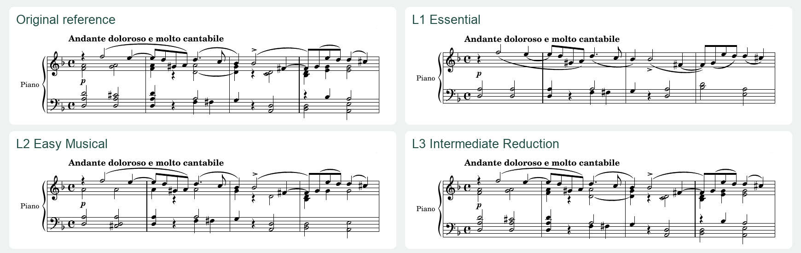

# October: one passage, four versions

[简体中文](README.zh-CN.md) · [Project](../../README.md) · [Full comparison PDF](comparison.pdf)

Tchaikovsky, *The Seasons*, October, opening **mm. 1–16**. This opening section reaches its D-minor arrival; the original continues at bar 17. Every version covers the same bars. They were transcribed and arranged afresh for this showcase, rather than repackaging the earlier experimental L2.

| Version | PDF / full-page image | Canonical notation | Listening file | Evidence |
|---|---|---|---|---|
| Original reference | [PDF](original.pdf) / [PNG](original.png) | [MusicXML](original.musicxml) | [MuseScore MIDI, unverified](original.musescore-unverified.mid) | [QA](original.qa.json) |
| L1 Essential | [PDF](l1.pdf) / [PNG](l1.png) | [MusicXML](l1.musicxml) | [MIDI](l1.mid) | [QA](l1.qa.json) / [change map](l1-arrangement-map.json) |
| L2 Easy Musical | [PDF](l2.pdf) / [PNG](l2.png) | [MusicXML](l2.musicxml) | [MIDI](l2.mid) | [QA](l2.qa.json) / [change map](l2-arrangement-map.json) |
| L3 Intermediate Reduction | [PDF](l3.pdf) / [PNG](l3.png) | [MusicXML](l3.musicxml) | [MIDI](l3.mid) | [QA](l3.qa.json) / [change map](l3-arrangement-map.json) |

The five-page comparison contains one guide page followed by the four unchanged score pages. The preview shows only the first four bars. Scores use MuseScore 4.7.5, readable A4 notation and a common quarter-note tempo of 52 for comparison. The source does not prescribe that metronome mark.

## What the arrangements change

All three preserve the timed main RH melody and LH thematic response in bars 9–14, including their pitch, onset and tied duration. They keep the original key, meter, chromatic melody, triplets and 16-bar route. This protection is checked against the bounded transcription, not certified against every edition.

- **L1 Essential:** removes RH inner filling, reduces held chord tones and revoices LH support within seven semitones. The main line and answering voice remain. The thinner texture loses harmonic fullness and original bass register; melodic octave jumps and triplet reading remain.
- **L2 Easy Musical:** retains more harmonic and inner-voice colour, removes some doublings and revoices wide LH notes within nine semitones. It remains more active than L1: some LH position changes approach 16.33 semitones by the centroid proxy. Voicing and coordination are still unresolved for an individual player.
- **L3 Intermediate Reduction:** keeps 252 of 253 timed written pitched events while revoicing wide LH bass notes and removing one conflicting doubling. LH held reach drops from 17 to 12 semitones. This demonstrates how changing register can reduce burden with very few deletions, while octave reach, multi-voice balance and substantial LH travel remain.

All reductions omit **five grace notes** and flatten **two rolled chords with four staff arpeggiation symbols**. That removes ornament execution but changes the expressive attack. They are explicit musical losses, not a claim that every defining feature survived. Source fingering and pedal indications are excluded from the reference and all reductions; some slur/direction attachment positions are interpretive. The reference retains the five graces and four roll symbols.

## Measured signals and their limits

| Signal | Original | L1 | L2 | L3 |
|---|---:|---:|---:|---:|
| Timed written pitched events, before tie merging | 253 | 196 | 230 | 252 |
| Maximum held span, RH / LH, semitones | 12 / 17 | 0 / 7 | 9 / 9 | 12 / 12 |
| Maximum simultaneous held pitches, RH / LH | 3 / 4 | 1 / 2 | 3 / 3 | 3 / 4 |
| Maximum LH centroid change, semitones | 18.00 | 9.50 | 16.33 | 17.50 |
| Maximum RH centroid change, semitones | 12.00 | 12.00 | 12.00 | 12.00 |

[Full metrics](METRICS.json) use written holds and explicit staff-to-hand assignments. Original's comparison projection excludes grace duration and rolled onset offsets; it is not full original playback verification. Pedal does not silently shorten a written hold. Centroid movement is a geometric proxy, not fingering or a verdict on real hand travel. Maximum attack-group density stays 3 per second at the assumed tempo, so lower note count does not imply every burden fell.

## QA status

[Summary](QA.json): all four canonical XML files pass schema validation and every final score page was inspected by the agent. The timed protected lines match across versions. Source fidelity means a bounded agent comparison with the identified Schirmer page; human source/critical-edition review was not performed.

L1/L2/L3 pass timeline, difficulty thresholds, hand-conflict checks and serialized MIDI readback, but remain **REVIEW_REQUIRED** for musical acceptance. Their internal MIDI is exact for the represented notes/times, with uniform velocity and no expressive pedal, dynamics or rubato.

Original remains **INCOMPLETE** for internal playback because it keeps grace/roll notation without an accepted realization proposal. Its separately exported MuseScore MIDI is supplied as an **unverified audition aid**, not playback authority. Human listening, playing, musical acceptance and calibrated pedagogical grading are **NOT_RUN** for every version. Technical checks do not establish that L1 is suitable for a beginner or that any version suits a particular hand.

[Source and redistribution basis](SOURCE.en.md) · [Source metadata](SOURCE.json) · [Editable transcription events](transcription-events.json)
